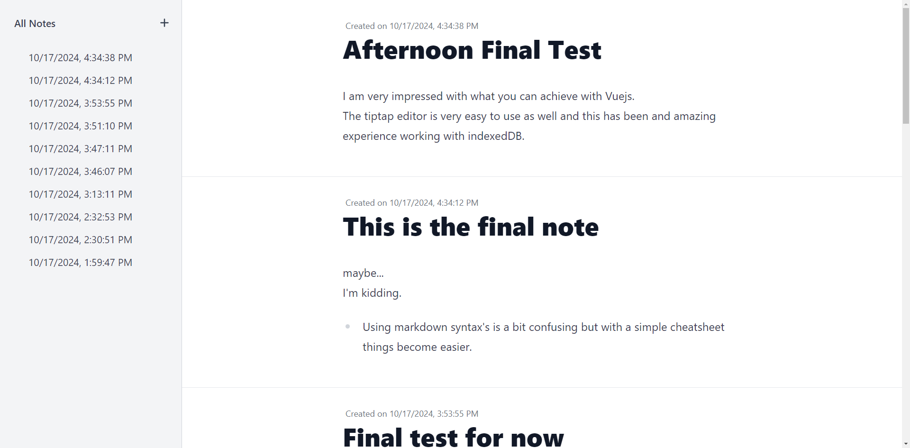
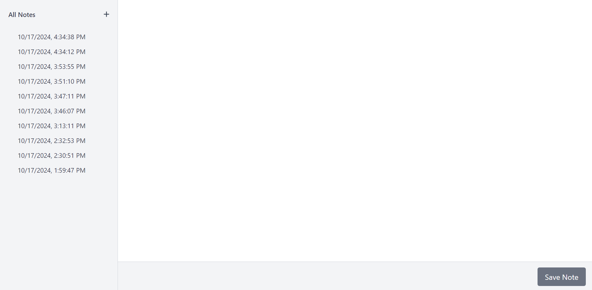
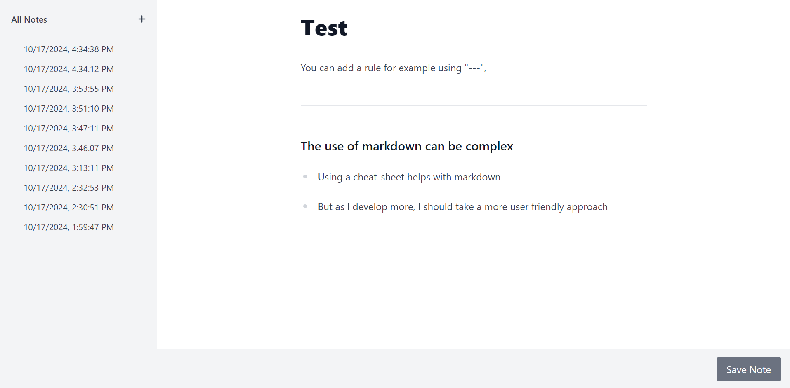

<h1 align="center" style="font-family: 'Orbitron', sans-serif;">Vuejs Notes App</h1>

<p align="justify">
  Depending on the application, users might benifit from us building applications with an offline-first approach which will even help users with a spotty or missing internet connectivity. This will also increase the overall reponse time of the application while also providing users with a safety net incase of a missing internet connectivity. This is made possible using specialized files called Service Workers. To build such an application I have used Vue.js as my main technology.
</p>

---

## Key Points

- **All Notes**: Can view all the nots from latest at top.
- **Add Note**: The plus button (create note) lets you creates a new note.
- **Sidebar**: The sidebar shows all the previous notes and links to them.
- **Editor**: Editor page built using the tiptap editor.
- **Save Notes**: New notes or previously altered notes can be saved to the DB which uses indexedDB.

---

## Tech Stack

- **Vuejs**: [Vuejs 3](https://vuejs.org/)
- **Vue CLI**: Allows for better package installations. (ex: vue tailwindcss, vue pwa, ect)
- **TailwindCSS**: [TailwindCSS](https://tailwindcss.com/)
- **Database**: [IndexedDB](https://developer.mozilla.org/en-US/docs/Web/API/IndexedDB_API)
- **tiptap Editor**: [tiptap](https://tiptap.dev/docs/editor/getting-started/install/vue3)
- **Nodejs**: Developer enviornments

---

## Screenshots

### NotesPage



### EmptyEditorPage



### EditorPage



---

## Unresolved Issues:

<p align="justify">
  Due to an error within the node production enviornment, the offline application does not refresh. This will be fixed in an upcoming update.
</p>

---

## Installation

```
npm install
```

### Compiles and hot-reloads for development

```
npm run serve
```

### Compiles and minifies for production

```
npm run build
```

### Customize configuration

See [Configuration Reference](https://cli.vuejs.org/config/)
